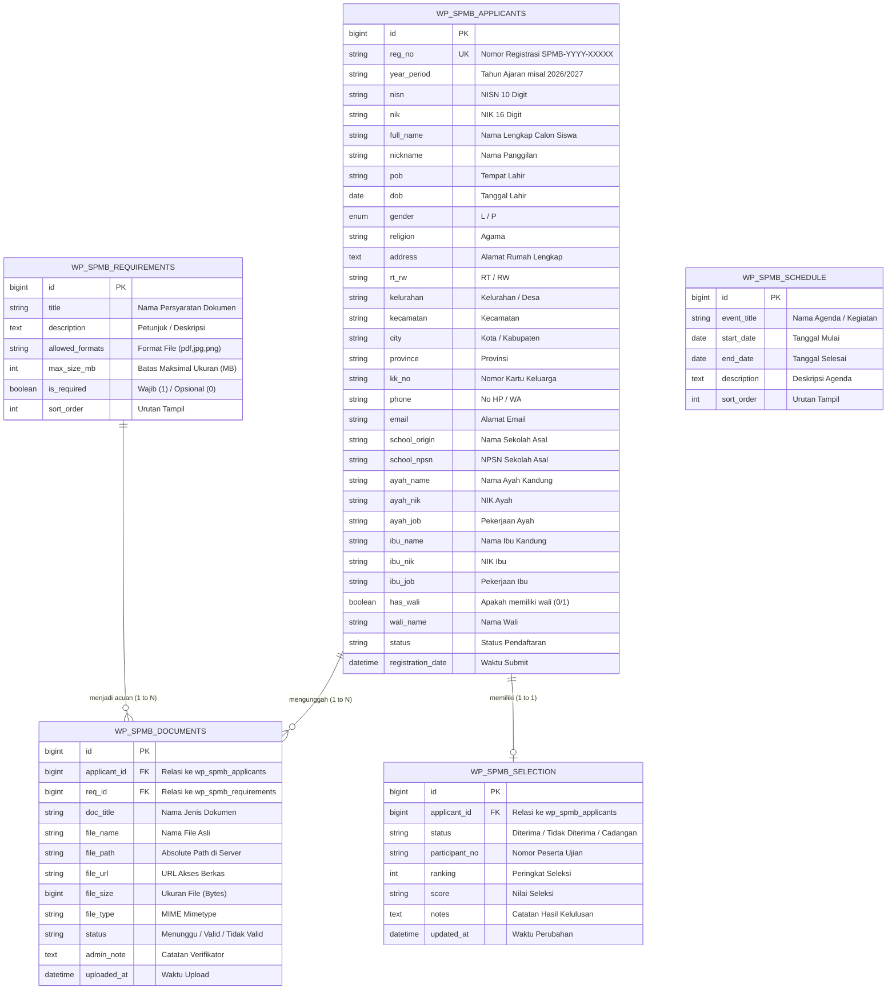

# 🗄️ DOKUMENTASI ARSITEKTUR DATABASE & SKEMA TABEL SPMB

---

## 1. Pendekatan Desain Database

Pada pengembangan modul SPMB ini, data pendaftaran **tidak disimpan sebagai WordPress Custom Post Type (CPT)** standar. Keputusan arsitektural ini diambil dengan pertimbangan:

1. **Skalabilitas & Kinerja Query**: Data pendaftar memiliki lebih dari 40 field relasional (biodata siswa, data ayah, ibu, wali, sekolah asal, berkas, status seleksi). Jika menggunakan `wp_posts` dan `wp_postmeta`, satu pendaftar akan menghasilkan >40 baris `postmeta`, yang akan memperlambat query saat jumlah pendaftar mencapai ribuan.
2. **Keamanan & Integritas Data**: Penggunaan tabel custom relasional (`InnoDB`) memungkinkan pembentukan *index* khusus (`reg_no`, `status`, `full_name`), serta mempermudah ekspor data dalam bentuk relasional murni (CSV/Excel).
3. **Standar WordPress Compliant**: Pembuatan tabel menggunakan fungsi bawaan `dbDelta()` dari WordPress API Core (`wp-admin/includes/upgrade.php`) sehingga aman saat proses aktivasi maupun pembaruan plugin.

---

## 2. Diagram Relasi Entitas (ERD - Entity Relationship Diagram)



---

## 3. Kamus Data & Spesifikasi Tabel (Data Dictionary)

### A. Tabel `wp_spmb_applicants`
Menyimpan seluruh data identitas calon siswa, data orang tua (Ayah & Ibu), wali, sekolah asal, dan status pendaftaran.

| Nama Kolom | Tipe Data | Nullable | Key | Keterangan / Contoh Nilai |
|---|---|---|---|---|
| `id` | `bigint(20)` | NO | `PRIMARY KEY` | Auto Increment Identifier |
| `reg_no` | `varchar(50)` | NO | `UNIQUE KEY` | Kode Pendaftaran unik (misal: `SPMB-2026-000001`) |
| `year_period` | `varchar(20)` | NO | - | Periode Tahun Pelajaran (misal: `2026/2027`) |
| `nisn` | `varchar(20)` | YES | - | Nomor Induk Siswa Nasional (10 Digit) |
| `nik` | `varchar(20)` | YES | - | Nomor Induk Kependudukan Calon Siswa |
| `full_name` | `varchar(150)` | NO | `KEY` | Nama Lengkap Siswa sesuai Ijazah/Akta |
| `nickname` | `varchar(50)` | YES | - | Nama Panggilan |
| `pob` | `varchar(100)` | YES | - | Tempat Lahir |
| `dob` | `date` | YES | - | Tanggal Lahir (`YYYY-MM-DD`) |
| `gender` | `enum('L','P')` | NO | - | Jenis Kelamin (`L` = Laki-laki, `P` = Perempuan) |
| `religion` | `varchar(50)` | YES | - | Agama (`Islam`, `Kristen`, dll) |
| `address` | `text` | YES | - | Alamat Jalan / Rumah Lengkap |
| `rt_rw` | `varchar(20)` | YES | - | Nomor RT/RW |
| `kelurahan` | `varchar(100)` | YES | - | Kelurahan / Desa |
| `kecamatan` | `varchar(100)` | YES | - | Kecamatan |
| `city` | `varchar(100)` | YES | - | Kota / Kabupaten |
| `province` | `varchar(100)` | YES | - | Provinsi |
| `kk_no` | `varchar(20)` | YES | - | Nomor Kartu Keluarga |
| `phone` | `varchar(30)` | YES | - | Nomor HP / WhatsApp Aktif |
| `email` | `varchar(100)` | YES | - | Alamat Email Aktif |
| `school_origin` | `varchar(150)` | YES | - | Nama SD / MI Asal |
| `school_npsn` | `varchar(20)` | YES | - | NPSN Sekolah Asal |
| `ayah_name` | `varchar(150)` | YES | - | Nama Ayah Kandung |
| `ayah_nik` | `varchar(20)` | YES | - | NIK Ayah |
| `ayah_job` | `varchar(100)` | YES | - | Pekerjaan Ayah |
| `ibu_name` | `varchar(150)` | YES | - | Nama Ibu Kandung |
| `ibu_nik` | `varchar(20)` | YES | - | NIK Ibu |
| `ibu_job` | `varchar(100)` | YES | - | Pekerjaan Ibu |
| `has_wali` | `tinyint(1)` | NO | - | `1` jika memiliki wali, `0` jika tidak |
| `wali_name` | `varchar(150)` | YES | - | Nama Wali Murid (jika ada) |
| `status` | `varchar(50)` | NO | `KEY` | Status (`Baru`, `Menunggu Verifikasi`, `Terverifikasi`, `Diterima`, dll) |
| `is_docs_complete`| `tinyint(1)` | NO | - | Status kelengkapan berkas (`0` / `1`) |
| `admin_note` | `text` | YES | - | Catatan Internal Panitia SPMB |
| `registration_date`| `datetime` | NO | - | Waktu pendaftaran dikirim |

---

### B. Tabel `wp_spmb_documents`
Menyimpan berkas digital scan persyaratan yang diunggah oleh pendaftar.

| Nama Kolom | Tipe Data | Nullable | Key | Keterangan |
|---|---|---|---|---|
| `id` | `bigint(20)` | NO | `PRIMARY KEY` | Auto Increment Identifier |
| `applicant_id` | `bigint(20)` | NO | `KEY` | Foreign Key mengacu ke `wp_spmb_applicants.id` |
| `req_id` | `bigint(20)` | YES | - | Foreign Key mengacu ke `wp_spmb_requirements.id` |
| `doc_title` | `varchar(150)` | NO | - | Nama Persyaratan Dokumen (misal: `Kartu Keluarga`) |
| `file_name` | `varchar(255)` | NO | - | Nama Asli File saat diunggah |
| `file_path` | `varchar(255)` | NO | - | Absolute File Path pada server file system |
| `file_url` | `varchar(255)` | NO | - | URL HTTP publik/akses terproteksi file |
| `file_size` | `bigint(20)` | YES | - | Ukuran berkas dalam Satuan Bytes |
| `file_type` | `varchar(100)` | YES | - | MIME Type file (misal: `image/png`, `application/pdf`) |
| `status` | `varchar(30)` | NO | - | Status Verifikasi Berkas (`Menunggu`, `Valid`, `Tidak Valid`) |
| `admin_note` | `text` | YES | - | Alasan jika berkas `Tidak Valid` |

---

### C. Tabel `wp_spmb_requirements`
Menyimpan konfigurasi berkas dokumen persyaratan yang dapat diatur dinamis oleh administrator.

| Nama Kolom | Tipe Data | Keterangan |
|---|---|---|
| `id` | `bigint(20)` | Primary Key |
| `title` | `varchar(150)` | Judul Persyaratan (misal: `Akta Kelahiran`) |
| `description` | `text` | Petunjuk mengunggah untuk calon siswa |
| `allowed_formats`| `varchar(100)` | Format yang diizinkan (misal: `pdf,jpg,jpeg,png`) |
| `max_size_mb` | `int(11)` | Batas ukuran berkas maksimal dalam Megabytes |
| `is_required` | `tinyint(1)` | Flag `1` (Wajib) atau `0` (Opsional) |
| `sort_order` | `int(11)` | Urutan tampilan pada formulir |

---

### D. Tabel `wp_spmb_selection`
Menyimpan penetapan hasil seleksi dan pengumuman kelulusan pendaftar.

| Nama Kolom | Tipe Data | Keterangan |
|---|---|---|
| `id` | `bigint(20)` | Primary Key |
| `applicant_id` | `bigint(20)` | Unique Foreign Key ke `wp_spmb_applicants.id` |
| `status` | `varchar(50)` | Status Kelulusan (`Diterima`, `Tidak Diterima`, `Cadangan`) |
| `participant_no` | `varchar(50)` | Nomor Peserta Tes / Seleksi |
| `ranking` | `int(11)` | Peringkat kelulusan |
| `score` | `varchar(20)` | Total Nilai Tes / Rata-rata Raport |
| `notes` | `text` | Catatan pengumuman untuk pendaftar |

---

## 4. Script DDL (Data Definition Language) SQL

Berikut adalah potongan script SQL pembuatan tabel yang dieksekusi secara otomatis oleh modul PHP melalui fungsi `SPMB_DB::init_db()`:

```sql
-- 1. Tabel Applicants
CREATE TABLE wp_spmb_applicants (
    id bigint(20) NOT NULL AUTO_INCREMENT,
    reg_no varchar(50) NOT NULL,
    year_period varchar(20) NOT NULL DEFAULT '2026/2027',
    nisn varchar(20) DEFAULT '',
    nik varchar(20) DEFAULT '',
    full_name varchar(150) NOT NULL,
    nickname varchar(50) DEFAULT '',
    pob varchar(100) DEFAULT '',
    dob date DEFAULT NULL,
    gender enum('L', 'P') NOT NULL DEFAULT 'L',
    religion varchar(50) DEFAULT 'Islam',
    address text DEFAULT NULL,
    rt_rw varchar(20) DEFAULT '',
    kelurahan varchar(100) DEFAULT '',
    kecamatan varchar(100) DEFAULT '',
    city varchar(100) DEFAULT '',
    province varchar(100) DEFAULT '',
    kk_no varchar(20) DEFAULT '',
    phone varchar(30) DEFAULT '',
    email varchar(100) DEFAULT '',
    school_origin varchar(150) DEFAULT '',
    school_npsn varchar(20) DEFAULT '',
    ayah_name varchar(150) DEFAULT '',
    ayah_nik varchar(20) DEFAULT '',
    ayah_pob_dob varchar(100) DEFAULT '',
    ayah_education varchar(50) DEFAULT '',
    ayah_job varchar(100) DEFAULT '',
    ayah_income varchar(100) DEFAULT '',
    ayah_phone varchar(30) DEFAULT '',
    ibu_name varchar(150) DEFAULT '',
    ibu_nik varchar(20) DEFAULT '',
    ibu_pob_dob varchar(100) DEFAULT '',
    ibu_education varchar(50) DEFAULT '',
    ibu_job varchar(100) DEFAULT '',
    ibu_income varchar(100) DEFAULT '',
    ibu_phone varchar(30) DEFAULT '',
    has_wali tinyint(1) NOT NULL DEFAULT 0,
    wali_name varchar(150) DEFAULT '',
    wali_nik varchar(20) DEFAULT '',
    wali_pob_dob varchar(100) DEFAULT '',
    wali_education varchar(50) DEFAULT '',
    wali_job varchar(100) DEFAULT '',
    wali_income varchar(100) DEFAULT '',
    wali_phone varchar(30) DEFAULT '',
    status varchar(50) NOT NULL DEFAULT 'Baru',
    is_docs_complete tinyint(1) NOT NULL DEFAULT 0,
    admin_note text DEFAULT NULL,
    registration_date datetime DEFAULT CURRENT_TIMESTAMP,
    updated_at datetime DEFAULT CURRENT_TIMESTAMP ON UPDATE CURRENT_TIMESTAMP,
    PRIMARY KEY  (id),
    UNIQUE KEY reg_no (reg_no),
    KEY status (status),
    KEY full_name (full_name)
) ENGINE=InnoDB DEFAULT CHARSET=utf8mb4;
```
