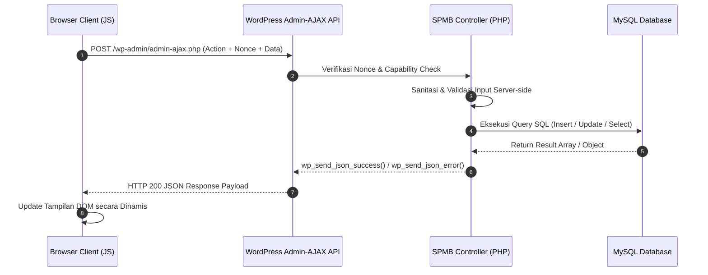

# 🧩 ARSITEKTUR KODE & ECOSYSTEM PLUGIN WORDPRESS (`spmb-system`)

---

## 1. Struktur File & Folder Plugin

Seluruh logika sistem SPMB dikemas secara modular sebagai WordPress Custom Plugin pada lokasi `wp-content/plugins/spmb-system/`.

```text
spmb-system/
├── spmb-system.php                   <-- Entry Point Main Plugin File
├── includes/
│   ├── class-spmb-db.php             <-- Class Abstraksi Database (CRUD & Table Schema)
│   ├── class-spmb-admin.php          <-- Class Controller Dashboard Admin (Menu & AJAX Admin)
│   ├── class-spmb-public.php         <-- Class Controller Frontend (Shortcodes & Public AJAX)
│   └── class-spmb-emailer.php        <-- Class Service Email (HTML Email Notification Engine)
└── assets/
    ├── css/
    │   ├── spmb-admin.css            <-- Stylesheet Tampilan Dashboard Admin
    │   └── spmb-public.css           <-- Stylesheet Tampilan Halaman Publik & Form Multi-step
    └── js/
        ├── spmb-admin.js             <-- JavaScript Handler AJAX & Modal Drawer Admin
        └── spmb-public.js            <-- JavaScript Handler Multi-step Form & Search Result
```

---

## 2. Pola Desain (Design Pattern) & Lifecycle Plugin

Modul ini mengadopsi pola desain **Object-Oriented Programming (OOP)** dengan pembagian peran (*Separation of Concerns*) yang jelas:

1. **Bootstrap (`spmb-system.php`)**:
   - Mendefinisikan konstanta global (`SPMB_VERSION`, `SPMB_PLUGIN_DIR`, `SPMB_PLUGIN_URL`).
   - Mendaftarkan *Activation Hook* (`register_activation_hook`) untuk membuat tabel MySQL, mengisi data awal (seeding), dan menjamin 3 halaman WordPress (`/spmb/`, `/spmb-pendaftaran/`, `/spmb-hasil-seleksi/`) otomatis dibuat saat aktivasi.
2. **Database Layer (`SPMB_DB`)**:
   - Berisi fungsi-fungsi *static* untuk interaksi dengan `$wpdb`, skema DDL, fungsi generator nomor pendaftaran otomatis `SPMB-YYYY-XXXXX`, serta penghitung statistik pendaftar.
3. **Admin Controller (`SPMB_Admin`)**:
   - Mendaftarkan menu utama **SPMB** dan 6 sub-menu pada WordPress Dashboard (`admin_menu`).
   - Mengurus pengiriman aset CSS/JS khusus halaman admin (`admin_enqueue_scripts`).
   - Menangani pengolahan AJAX admin (`wp_ajax_...`) untuk perbarui status, modal drawer detail 6-tab, verifikasi dokumen, dan ekspor CSV.
4. **Public Controller (`SPMB_Public`)**:
   - Mendaftarkan 3 WordPress Shortcodes (`[spmb_main_page]`, `[spmb_registration_form]`, `[spmb_selection_results]`).
   - Menangani endpoint AJAX publik (`wp_ajax_nopriv_...`) untuk submit form pendaftaran dan pencarian hasil seleksi.
5. **Notification Service (`SPMB_Emailer`)**:
   - Memformat template HTML email konfirmasi pendaftaran kepada calon murid dan email peringatan (*alert*) ke admin sekolah.

---

## 3. Pendaftaran Shortcode & Mekanisme Rendering

Modul menggunakan WordPress Shortcode API untuk menampilkan antarmuka halaman publik secara dinamis tanpa mengganggu tema utama WordPress (Astra Theme):

| Nama Shortcode | Halaman Target / Slug | Fungsi Renderer |
|---|---|---|
| `[spmb_main_page]` | `/spmb/` | Menampilkan Landing Page Informasi SPMB, Badge Status, Key Dates, Timeline, Tata Cara, Persyaratan, & Tombol CTA Utama. |
| `[spmb_registration_form]` | `/spmb-pendaftaran/` | Menampilkan Formulir Online Multi-step 5 Tahap (Biodata -> OrTu -> Sekolah -> Upload Berkas -> Review & Submit) & Layar Sukses. |
| `[spmb_selection_results]` | `/spmb-hasil-seleksi/` | Menampilkan Engine Pencarian Hasil Seleksi & Kelulusan berdasarkan No. Pendaftaran atau Nama. |

---

## 4. Mekanisme Komunikasi Data via AJAX (Asynchronous JavaScript & XML)

Seluruh pemrosesan formulir publik maupun tindakan admin menggunakan teknologi AJAX sehingga pengguna **tidak perlu menguji reload halaman (no page refresh)**:



---

## 5. Algoritma Generator Nomor Pendaftaran Otomatis

Nomor pendaftaran dihasilkan secara otomatis dan terjamin unik (*thread-safe & no duplicate*) oleh fungsi `SPMB_DB::generate_reg_no()`:

Format Kode: **`SPMB-[TAHUN]-[NOMOR_URUT_5_DIGIT]`**  
Contoh: `SPMB-2026-000123`

```php
public static function generate_reg_no() {
    global $wpdb;
    $settings = get_option('spmb_settings', []);
    $period_year = !empty($settings['period_year']) ? substr($settings['period_year'], 0, 4) : '2026';
    
    $table = self::get_table_applicants();
    $prefix = "SPMB-{$period_year}-";

    // Query nomor urut tertinggi untuk tahun ajaran aktif
    $max_no = $wpdb->get_var($wpdb->prepare(
        "SELECT MAX(CAST(SUBSTRING_INDEX(reg_no, '-', -1) AS UNSIGNED)) FROM $table WHERE reg_no LIKE %s",
        $prefix . '%'
    ));

    $next_num = ($max_no) ? intval($max_no) + 1 : 1;
    return $prefix . str_pad($next_num, 5, '0', STR_PAD_LEFT);
}
```
