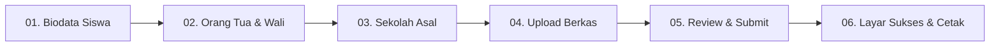
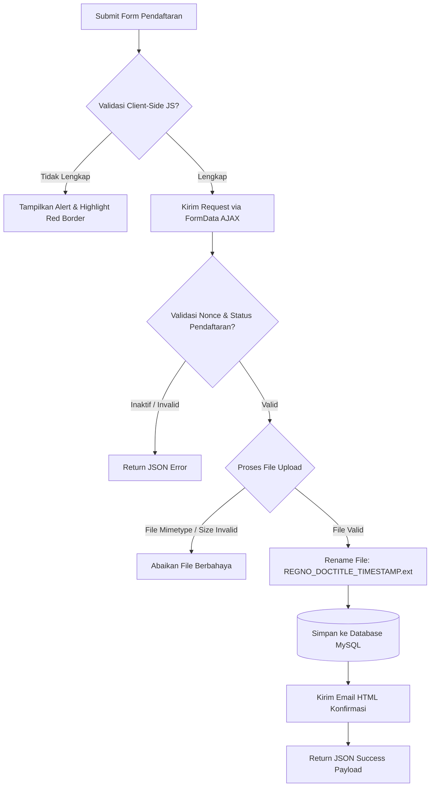

# 📝 MODUL HALAMAN FORMULIR PENDAFTARAN ONLINE MULTI-STEP (`/spmb-pendaftaran/`)

---

## 1. Deskripsi & Pengalaman Pengguna (User Experience)

Halaman Formulir Pendaftaran Online dirancang menggunakan pendekatan **Multi-Step Form (Wizard Form)** 5 Tahap. Pendekatan ini dipilih agar formulir pendaftaran yang memiliki lebih dari 30 field input tidak membebani calon pendaftar, meningkatkan tingkat penyelesaian (*conversion rate*), dan memudahkan validasi data secara bertahap.

URL Akses: `http://localhost/asy-syuhada/spmb-pendaftaran/`  
Shortcode Handler: `[spmb_registration_form]`

---

## 2. Alur & Struktur 5 Tahap Formulir



### Tahap 1: Biodata Calon Siswa (`step-pane-1`)
- **Penanda Nomor Registrasi Preview**: Menampilkan estimasi kode pendaftaran (misal `SPMB-2026-000001`).
- **Field Data**: NISN (10 Digit), NIK (16 Digit), Nama Lengkap, Nama Panggilan, Tempat Lahir, Tanggal Lahir, Jenis Kelamin (L/P), Agama, No. KK, No. HP/WhatsApp (Aktif), Email, Alamat Lengkap, RT/RW, Kelurahan/Desa, Kecamatan, Kota/Kabupaten, Provinsi.

### Tahap 2: Data Orang Tua & Wali (`step-pane-2`)
- **Data Ayah Kandung**: Nama Ayah, NIK Ayah, Tempat/Tgl Lahir, Pendidikan Terakhir, Pekerjaan, Penghasilan Bulanan, No. HP Ayah.
- **Data Ibu Kandung**: Nama Ibu, NIK Ibu, Tempat/Tgl Lahir, Pendidikan Terakhir, Pekerjaan, Penghasilan Bulanan, No. HP Ibu.
- **Toggle Data Wali (Opsional)**: Checkbox `Apakah Calon Murid Memiliki Wali?`. Jika dicentang, form Data Wali (Nama, NIK, Pekerjaan, No HP) akan terbuka secara otomatis dengan efek animasi slide.

### Tahap 3: Data Sekolah Asal (`step-pane-3`)
- Nama SD / MI Asal dan NPSN Sekolah Asal.

### Tahap 4: Upload Berkas Dokumen Persyaratan (`step-pane-4`)
- Menampilkan file uploader dinamis sesuai daftar persyaratan aktif dari database.
- Setiap uploader memiliki petunjuk format yang diizinkan (`pdf`, `jpg`, `png`) dan batas ukuran file (`MB`).

### Tahap 5: Review Rangkuman Data & Submit (`step-pane-5`)
- Menampilkan **Tabel Rangkuman Kompleks** yang merangkum seluruh data yang diinput pada Tahap 1 hingga Tahap 4 melalui JavaScript secara otomatis.
- **Checkbox Pernyataan Keabsahan**: Pendaftar wajib mencentang *"Saya menyatakan bahwa data dan berkas dokumen yang saya masukkan adalah BENAR dan SAH"*.
- **Tombol Submit**: `🚀 Kirim Pendaftaran Sekarang`.

### Tahap 6: Layar Sukses (Pendaftaran Berhasil)
- Ditampilkan via AJAX setelah data berhasil disimpan ke MySQL.
- Menampilkan **Nomor Pendaftaran Resmi** dalam kotak hijau mencolok.
- Tombol **🖨️ Cetak / Simpan Bukti Pendaftaran** yang memicu `window.print()` dengan stylesheet khusus cetak.

---

## 3. Validasi Client-Side & Server-Side Security



---

## 4. Keamanan File Upload Handling

Proses pengunggahan berkas mengimplementasikan lapisan keamanan tinggi:

1. **Penyimpanan Terisolasi**: Berkas disimpan di `wp-content/uploads/spmb_docs/YYYY/`.
2. **Proteksi `.htaccess`**: Direktori `spmb_docs/` diproteksi secara otomatis dengan file `.htaccess` yang menolak eksekusi skrip PHP/CGI:
   ```apache
   Options -Indexes
   <FilesMatch "\.(php|php5|phtml|php7|phps)$">
       Order Deny,Allow
       Deny from all
   </FilesMatch>
   ```
3. **Pengubahan Nama File Unik**: Nama file diubah secara otomatis menggunakan format `[REG_NO]_[TITLE]_[TIMESTAMP].[EXT]` untuk mencegah kerentanan *Overwriting* dan *Path Traversal*.
