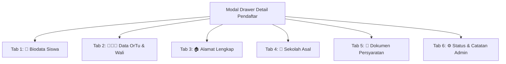
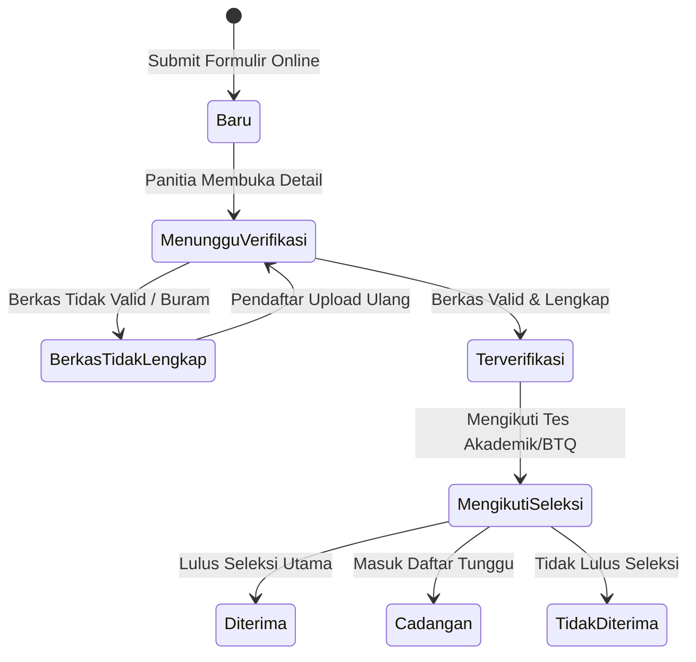

# 👥 MODUL MANAJEMEN PENDAFTAR & VERIFIKASI BERKAS (`WP-Admin -> SPMB -> Pendaftar`)

---

## 1. Deskripsi Modul

Modul **Pendaftar** merupakan pusat kerja operasional (*Operational Hub*) bagi Panitia SPMB/Operator Sekolah untuk melihat, mengecek, memverifikasi dokumen persyaratan, mengubah status pendaftaran, serta mendownload rekapitulasi data pendaftar.

Location Slug: `admin.php?page=spmb-applicants`

---

## 2. Fitur Filter, Pencarian, & Ekspor CSV

### A. Baris Pencarian & Filter Status
- **Pencarian Global**: Mencari berdasarkan No. Pendaftaran, Nama Siswa, NISN, atau Nama Sekolah Asal.
- **Filter Status**: Menyaring pendaftar berdasarkan status spesifik (`Baru`, `Menunggu Verifikasi`, `Berkas Tidak Lengkap`, `Terverifikasi`, `Mengikuti Seleksi`, `Diterima`, `Tidak Diterima`, `Cadangan`).
- **Pagination**: Membagi daftar pendaftar sebanyak 15 item per halaman.

### B. Ekspor Data CSV / Excel
- Tersedia tombol **📥 Export CSV / Excel** yang menghasilkan file `.csv` terstruktur berisi seluruh biodata pendaftar untuk kebutuhan pelaporan Dinas/Kemenag.

---

## 3. Drawer Modal Detail Pendaftar (6 Tab Interaktif)

Saat operator mengklik tombol `Detail` atau `No. Registrasi` pendaftar, sistem akan membuka **Drawer Modal Slide-In** 6 Tab via AJAX tanpa memuat ulang halaman:

### rincian Tab Modal Detail:

1. **Tab 1: 👤 Biodata Siswa**:
   - Menampilkan No. Registrasi, NISN, NIK, Nama Lengkap, Nama Panggilan, Tempat/Tgl Lahir, Gender, Agama, No. KK, Email, dan **Tombol Direct WhatsApp Chat** (`💬 Chat WA`).
2. **Tab 2: 👨‍👩‍👧 Data Orang Tua & Wali**:
   - Menampilkan identitas lengkap Ayah Kandung (Nama, NIK, Pekerjaan, Penghasilan, Phone), Ibu Kandung (Nama, NIK, Pekerjaan, Penghasilan, Phone), serta Data Wali (jika ada).
3. **Tab 3: 🏠 Alamat Lengkap**:
   - Menampilkan alamat rumah, RT/RW, Kelurahan, Kecamatan, Kota/Kabupaten, dan Provinsi.
4. **Tab 4: 🏫 Sekolah Asal**:
   - Menampilkan Nama Sekolah SD/MI asal dan NPSN sekolah.
5. **Tab 5: 📎 Dokumen Persyaratan & Verifikator Berkas**:
   - Menampilkan tabel seluruh berkas scan yang diunggah pendaftar.
   - Operator dapat melakukan **Live Preview / Download File**.
   - Operator dapat mengubah status validasi per dokumen (`Menunggu`, `🟢 Valid`, `🔴 Tidak Valid`).
6. **Tab 6: ⚙️ Perubahan Status & Catatan Admin**:
   - Operator dapat mengubah status pendaftaran calon siswa (misal dari `Baru` -> `Menunggu Verifikasi` -> `Terverifikasi` -> `Diterima`).
   - Operator dapat menginput **Catatan Admin / Catatan Panitia** (misal: *"Scan Kartu Keluarga buram, harap bawa fisik saat tes"*).

---

## 4. Alur Perubahan Status Pendaftaran (Status Lifecycle)

