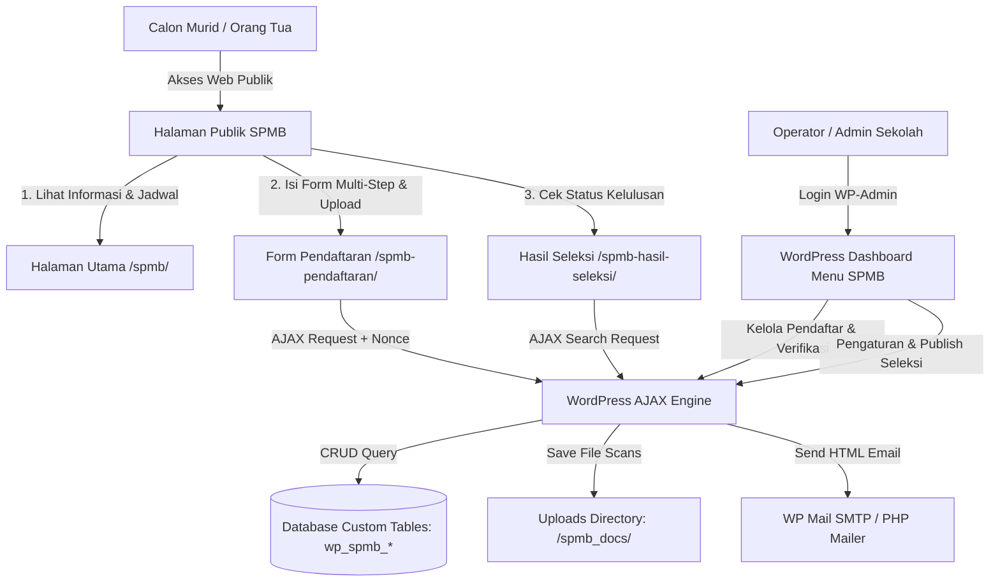

# 📚 DOKUMENTASI LENGKAP SISTEM PENERIMAAN MURID BARU (SPMB)
**Sub-Sistem Profil & Pendaftaran Sekolah berbasis WordPress — MTs Asy-Syuhada**

---

## 📌 Pengantar & Tujuan Dokumen

Dokumen ini disusun sebagai **Bahan Pembahasan & Dokumentasi Teknis Skripsi / Tugas Akhir** dalam bidang *Teknik Informatika / Sistem Informasi / Rekayasa Perangkat Lunak*.

Dokumentasi ini mencakup arsitektur sistem, rancangan basis data relasional, alur kerja (workflow), analisis modul publik dan administrator, pengujian perangkat lunak (blackbox testing), serta analisis aspek keamanan informasi (security & privacy).

---

## 🗺️ Struktur & Sitemap Dokumentasi

Untuk memudahkan pemahaman per modul dan kebutuhan bab pada naskah skripsi, dokumen ini dibagi menjadi beberapa folder dan file terstruktur sebagai berikut:

```text
c:\xampp\htdocs\WebProfileSekolah-DewiAnjani\docs\
├── README.md                                          <-- Indeks & Ringkasan Utama
├── 01_arsitektur_sistem/
│   ├── 01_arsitektur_database_dan_skema_tabel.md     <-- Kamus Data, ERD, DDL MySQL, Skalabilitas
│   └── 02_arsitektur_plugin_wordpress.md            <-- Struktur File Plugin, Hooks, Shortcodes, AJAX Architecture
├── 02_modul_halaman_publik/
│   ├── 01_page_utama_spmb.md                          <-- Landing Page, Status Indicator, Timeline, CTA
│   ├── 02_page_pendaftaran_multistep.md              <-- Form Multi-Step, Generator No. Reg, Security Upload
│   └── 03_page_hasil_seleksi.md                      <-- Engine Pencarian Hasil Seleksi, Data Privacy Protection
├── 03_modul_wordpress_dashboard/
│   ├── 01_dashboard_dan_statistik.md                 <-- Real-time KPI Cards, SVG Dynamic Chart, Summary
│   ├── 02_manajemen_pendaftar_dan_verifikasi.md      <-- Datatable, Drawer 6 Tab, Verifikasi Berkas, Export CSV
│   ├── 03_manajemen_persyaratan_dan_jadwal.md         <-- Dynamic Requirements Builder & Timeline Schedule Manager
│   └── 04_pengaturan_dan_hasil_seleksi.md            <-- System Toggle, Email Template, Publish Result Engine
└── 04_panduan_pengujian_dan_keamanan/
    ├── 01_pengujian_sistem_dan_blackbox.md           <-- Skenario Pengujian Black-Box & Hasil Uji
    └── 02_aspek_keamanan_dan_privasi_data.md         <-- Nonce, Sanitization, Escaping, Htaccess File Security
```

---

## 💻 Ringkasan Spesifikasi Teknis System

| Parameter Teknis | Spesifikasi Sistem |
|---|---|
| **CMS Platform** | WordPress 6.x |
| **Bahasa Pemrograman** | PHP 8.2+ (Object-Oriented Programming & Procedural Hooks) |
| **Database Management System** | MySQL / MariaDB (`InnoDB` Engine) |
| **Arsitektur Ekosistem** | WordPress Custom Plugin (`spmb-system`) |
| **Database Abstraction** | Custom MySQL Tables via `dbDelta()` API |
| **Frontend Styling** | Modern Vanilla CSS3 (Custom Variables, Flexbox, CSS Grid, Micro-animations) |
| **Frontend Scripting** | JavaScript (jQuery + Fetch AJAX API) |
| **Notifikasi** | WordPress Mail API (`wp_mail`) dengan HTML Template Support |
| **Keamanan File Upload** | Dynamic Unique File Renaming, MIME Mimetype Checking, & `.htaccess` Access Restriction |

---

## 📐 Diagram Arsitektur Ringkas (Mermaid)



---

## 🎓 Referensi Penggunaan untuk Skripsi

- **Bab III (Analisis dan Perancangan Sistem)**: Gunakan `01_arsitektur_sistem/` untuk rancangan ERD, Kamus Data, Flowchart, dan Arsitektur Software.
- **Bab IV (Implementasi dan Pengujian)**: Gunakan `02_modul_halaman_publik/`, `03_modul_wordpress_dashboard/`, dan `04_panduan_pengujian_dan_keamanan/01_pengujian_sistem_dan_blackbox.md` untuk tangkapan layar, kode sumber utama, dan pengujian sistem.
- **Bab V (Penutup / Kesimpulan & Saran)**: Gunakan evaluasi keamanan dan keandalan sistem pada `04_panduan_pengujian_dan_keamanan/02_aspek_keamanan_dan_privasi_data.md`.
